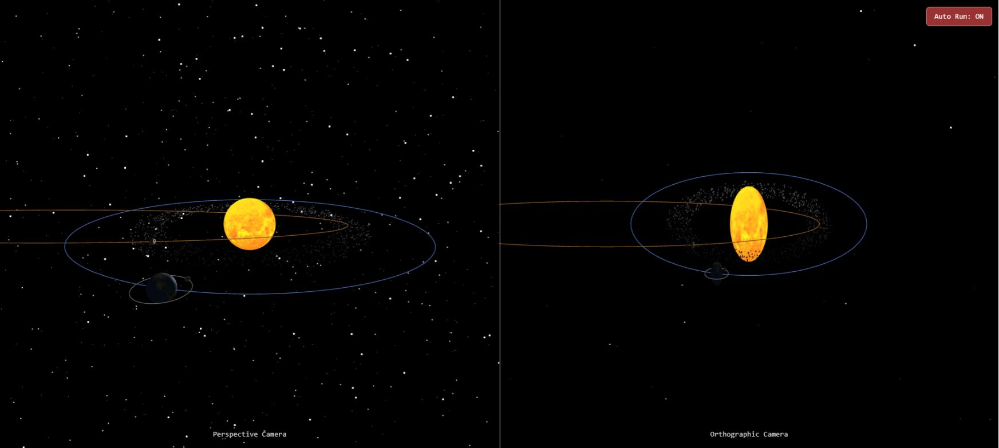

# Abdulrahman Alsaher

### AI Product Builder · Product Management · Consumer AI · Founder

I build Arabic-first consumer products from problem discovery and product strategy through UX, AI-assisted development, analytics, growth and operations.

Alongside building products, I study Computer Science at the **University of Manchester**. My engineering work spans computer engineering, processor architecture, microcontrollers, systems programming, graphics and web applications.

[LinkedIn](https://www.linkedin.com/in/abdulrahmansh/) · [Engineering project notes](PROJECTS.md)

## Products and initiatives

| Product | What I built | Measured outcome |
| --- | --- | --- |
| **Shater** | Arabic-first learning tools that turn study material into summaries, quizzes and flashcards | 4,600+ registered users and 50,000+ generated study items |
| **Qooti** | Nutrition tracking using AI and barcode scanning | 1,600+ registered users |
| **Taqreeb** | A youth-opportunity initiative supported by a 30-person volunteer team | 300 published opportunities, 60,000 website visitors and one million impressions |

I am also a **Qimam Fellow**, selected among 50 students from more than 18,000 applicants for its leadership development programme.

## Computer engineering and architecture

| Coursework | What it covers | Context |
| --- | --- | --- |
| [MU0 processor and digital logic](PROJECTS.md#mu0-processor-and-digital-logic) | Verilog ALU and datapath components, registers, multiplexers, flags, testbenches, assembly and FPGA builds | COMP12111 |
| [Stump processor architecture](PROJECTS.md#stump-processor-architecture) | A 16-bit gate-level ALU, fetch/execute/memory control decoding, testbench work and assembly | COMP22111 |
| [Microcontrollers](PROJECTS.md#microcontrollers) | Memory-mapped I/O, bus reads and writes, GPIO, interrupts and peripheral testbenches | COMP22712 |
| [RISC-V assembly](PROJECTS.md#risc-v-assembly) | Instruction execution, addressing, control flow, ABI conventions and stack operations | COMP15111 |

## Selected engineering work

| Project | Focus | Technologies | Verification |
| --- | --- | --- | --- |
| [Solar-system visualization](PROJECTS.md#solar-system-visualization) | Two camera views, custom lighting shaders and instanced asteroids | JavaScript, Three.js, GLSL | Browser rendering and controls checked |
| [EventLite](PROJECTS.md#eventlite) | Team event-management application with web and REST interfaces | Java, Spring Boot, JPA, H2 | 117 tests passed |
| [Processor emulator](PROJECTS.md#processor-emulator) | Refactoring a small 8-bit processor emulator | C++20, CMake, Catch2 | 83 test cases passed |
| [Cache simulator](PROJECTS.md#cache-simulator) | Comparing eviction policies using memory-access traces | Python, unittest | 30 tests passed |
| [Matrix library](PROJECTS.md#matrix-library) | Dynamic allocation, matrix arithmetic and file operations | C, Unity | 17 tests passed |
| [Register allocation](PROJECTS.md#register-allocation) | Greedy graph colouring for register assignment | Python | Example colouring validated |

*A real browser capture from my computer-graphics coursework. Planet textures: [Solar System Scope](https://www.solarsystemscope.com/textures/), [CC BY 4.0](https://creativecommons.org/licenses/by/4.0/).*

## What connects the work

- I start with the user problem and carry the work through implementation and measurement.
- I use engineering fundamentals to make practical product decisions.
- I care about products designed around Arabic-speaking users and their context.

Product source is private. University source repositories also remain private while course and team publication permissions are checked; the public [project notes](PROJECTS.md) document scope, contribution context and verification results.
